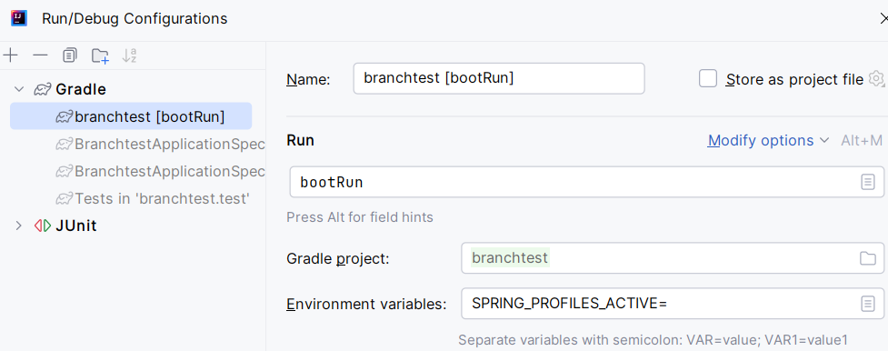
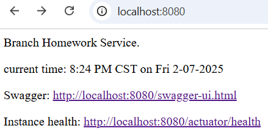

# Branch's Interview Take Home Test

# Table of contents
<hr>

1. [Overview](#overview)
1. [Starting the Server](#setup)
1. [Using](#using)

<a name="overview"></a>
# Overview
<hr>
The take home question asked for a Spring service that returns user data from GitHub. 
Just a single GET endpoint. This app does that. 

What's in the app:
- One REST endpoint to get summarized GitHub user info
  - Endpoint is versioned
  - Supports optional query param to flush the cache
- Default (`/`) REST endpoint
  - Returns HTML with service info and links to Swagger, Actuator
- Fetch service to pull user profile and repo data from GitHub
  - 2 calls, made in parallel
  - Cached results (Caffeine)
  - Added a circuit breaker library (Resilience4J) but didn't implement
- Unit and integration tests (Spock, mocks, instance tables)
  - i only wrote a few unit tests (controller, service) to show the approach. 
- Support and Config files
  - This README.md
  - build.gradle (with added support for integration testing)
  - docker-compose.yaml (not needed, just thought it was nice)
- Support stuff
  - Swagger (documentation and manual API execution)
  - Actuator (health, metrics and caches is exposed)
  - application.yaml
    - Support for different environments (default, dev, etc.)
    - Uses environment variables with defaults (for IAC support)
  - Logging (slf4j)
- Other
  - Model uses Java naming, autoconverts to snake on export to JSON
  - Constructor-level autowiring
  - Config properties are strong typed with intellisense-support
  - Global error handler (just for 404s)
  - lombok for immutable "records" with named parameter construction


<a name="setup"></a>
# Starting the Server
<hr>
Download the code (`git clone`). 
If you're using IntelliJ, load the project (`build.gradle`) and run.
If you aren't, go to the root folder and from the command line run:

```
./gradlew bootrun
```
(this works on Windows now too; i didn't know that until, out of curiosity, i tried it)

To run in a different environment, set the environment variable 
`SPRING_PROFILES_ACTIVE` to the environment you want. 
If you're using IntelliJ you can do this in the bootrun config.



You can set the environment from the command line by adding 
`-Dspring.profiles.active=dev`.

This interview question code just supports `dev` right now. 
And if you use it the code will have an error because i purposely put 
an invalid URL in it so that you can see how the code handles errors. 


<a name="using"></a>
# Using
<hr>

With the server running, from your favorite REST tool (Postman, Insomnia, etc.) go to 
`localhost:8080/v1/github/user/octoman`. 

Responses are cached so after the first hit you're going to get stale data. 
If you want to make sure you get the latest data, you can tell the service to flush the cache
using the `flush` query parameter: `localhost:8080/v1/github/user/octoman?flush`.

```
curl --location 'localhost:8080/v1/github/user/octoman?flush'
```

If you can't remember the URL, just go to the server root:



That will take you to the service info page, which has a link to Swagger. 
From there you can pick the method from a list and run it.


